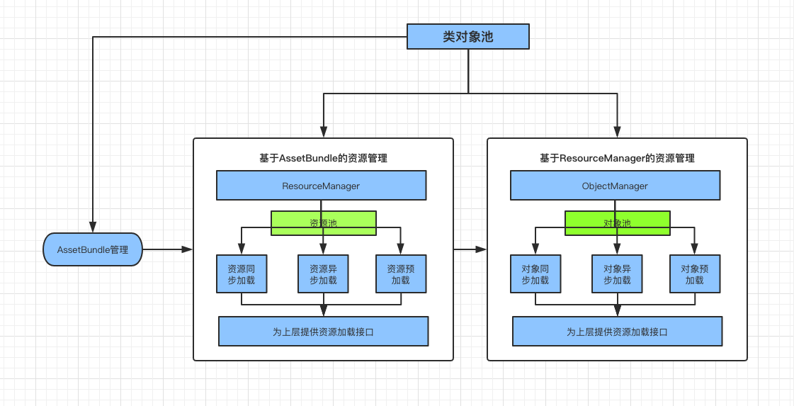

# 游戏底层资源管理加载框架

## 01 AssetBundle打包管理

### 预备知识介绍

#### 程序集

#### Unity资源加载方式介绍

- 拖到组件上

  ```csharp
      public GameObject m_Prefab;
  
      // Start is called before the first frame update
      void Start()
      {
          GameObject obj = Instantiate(m_Prefab);
      }
  ```

  

- Resource.load

  ```csharp
  GameObject obj = Instantiate(Resources.Load("Attack") as GameObject);
  ```

  

- AssetBundle (详细介绍 [http://www.sikiedu.com/course/74/tasks](http://www.sikiedu.com/course/74/tasks))

  - 给预设命名AssetBundle

    

  - 打包脚本

    ```csharp
    public class BundleEditor
    {
        [MenuItem("Tools/打包")]
    
        public static void Build()
        {
            // 打包
            BuildPipeline.BuildAssetBundles(Application.streamingAssetsPath, 
                BuildAssetBundleOptions.ChunkBasedCompression, 
                EditorUserBuildSettings.activeBuildTarget);
    
            // 刷新
            AssetDatabase.Refresh();
        }
    }
    ```

  - 加载AssetBundle代码

    ```csharp
    AssetBundle assetBundle = AssetBundle.LoadFromFile(Application.streamingAssetsPath + "/attack");
            GameObject obj2 = Instantiate(assetBundle.LoadAsset<GameObject>("attack"));
    ```

    

- AssetDataBase.LoadAtPath

  ```csharp
  GameObject obj3 = Instantiate(UnityEditor.AssetDatabase.LoadAssetAtPath<GameObject>("Assets/GameData/Prefabs/Attack.prefab"));
  ```

  

#### C#的XML序列化

- 类转成XML

  ```csharp
  [System.Serializable]
  public class SerializeTest
  {
      [XmlAttribute("Id")]
      public int Id { get; set; }
      [XmlAttribute("Name")]
      public string Name { get; set; }
      [XmlElement("List")]
      public List<int> List { get; set; }
  }
      
  
  		/// <summary>
      /// 数据模型
      /// </summary>
      void SeriaLizeTest()
      {
          SerializeTest sTest = new SerializeTest
          {
              Id = 1,
              Name = "测试",
              List = new List<int>()
          };
          sTest.List.Add(2);
          sTest.List.Add(3);
  
          XmlSerialize(sTest);
      }
  
      /// <summary>
      /// Xml 序列化
      /// </summary>
      /// <param name="test">Test.</param>
      void XmlSerialize(SerializeTest test)
      {
          // 打开文件流
          FileStream fileStream = new FileStream(Application.dataPath + "/test.xml", FileMode.Create,
              FileAccess.ReadWrite, FileShare.ReadWrite);
          // 写入流
          StreamWriter sw = new StreamWriter(fileStream, System.Text.Encoding.UTF8);
          XmlSerializer xml = new XmlSerializer(test.GetType());
          xml.Serialize(sw, test);
  
          // 关闭
          sw.Close();
          fileStream.Close();
      }
  
  ```

- XML 反序列化类

  ```csharp
  		/// <summary>
      /// 反序列化得到的数据
      /// </summary>
      void DeSerializeTest()
      {
          SerializeTest test = XmlDeSerialize();
          Debug.Log(test.Id + " " + test.Name);
          foreach (int item in test.List)
          {
              Debug.Log(item);
          }
      }
  
      /// <summary>
      /// Xml反序列化 Xml文件反序列化类 
      /// </summary>
      SerializeTest XmlDeSerialize()
      {
          // 打开文件流
          FileStream fileStream = new FileStream(Application.dataPath + "/test.xml", FileMode.Open,
              FileAccess.ReadWrite, FileShare.ReadWrite);
          XmlSerializer xs = new XmlSerializer(typeof(SerializeTest));
          SerializeTest test = (SerializeTest)xs.Deserialize(fileStream);
          fileStream.Close();
          return test;
      }
  ```

- 类序列化成二进制文件

  ```csharp
  		/// <summary>
      /// 类数据模型
      /// </summary>
      void BinarySeriaLizeTest()
      {
          SerializeTest sTest = new SerializeTest
          {
              Id = 9,
              Name = "测试类序列化二进制文件",
              List = new List<int>()
          };
          sTest.List.Add(10);
          sTest.List.Add(98);
  
          BinarySerialize(sTest);
      }
      /// <summary>
      /// 类序列化二进制文件
      /// </summary>
      /// <param name="test">Test.</param>
      void BinarySerialize(SerializeTest test)
      {
          FileStream fs = new FileStream(Application.dataPath + "/test.bytes", 
              FileMode.Create, 
              FileAccess.ReadWrite,
              FileShare.ReadWrite);
          BinaryFormatter bf = new BinaryFormatter();
          bf.Serialize(fs, test);
          fs.Close();
      }
  ```

- 二进制文件反序列化类

  ```csharp
  		/// <summary>
      /// 二进制文件反序列化类数据
      /// </summary>
      void BinaryDeserializeTest()
      {
          SerializeTest test = BinaryDeserialize();
          Debug.Log(test.Id + " " + test.Name);
          foreach (int item in test.List)
          {
              Debug.Log(item);
          }
      }
  
      /// <summary>
      /// 二进制文件反序列化类
      /// </summary>
      /// <returns>The deserialize.</returns>
      SerializeTest BinaryDeserialize()
      {
          TextAsset textAsset = UnityEditor.AssetDatabase.LoadAssetAtPath<TextAsset>("Assets/test.bytes");
          MemoryStream ms = new MemoryStream(textAsset.bytes);
          BinaryFormatter bf = new BinaryFormatter();
          SerializeTest test = (SerializeTest)bf.Deserialize(ms);
          ms.Close();
          return test;
      }
  
  ```

  

#### Unity Asset序列化

- 生成Asset

  ```csharp
  // 右键菜单栏-生成一个空的Asset文件，在Unity编辑器中填充数据
  [CreateAssetMenu(fileName = "TestAsset", menuName = "CreatAssets", order = 0)]
  
  public class AssetsSeriaLize : ScriptableObject
  {
      public int Id;
      public string Name;
      public List<string> TestList;
  }
  
  ```

  

  

- 读取生成的Asset

  ```csharp
  		#region Unity Asset 序列化
      /// <summary>
      /// Unity Asset 序列化
      /// </summary>
      void ReadTestAssets()
      {
          AssetsSeriaLize assets = UnityEditor.AssetDatabase.LoadAssetAtPath<AssetsSeriaLize>("Assets/Scripts/TestAsset.asset");
          Debug.Log(assets.Id + "" + assets.Name);
          foreach (string item in assets.TestList)
          {
              Debug.Log(item);
          }
      }
      #endregion
  
  ```

  

### AssetBundle打包管理

#### 01 打包策略

- 正常打包策略

  编辑器下设置文件夹或文件AB报名 -> 生成AB包 -> 根据manifest进行依赖加载

  优点：上手简单，方便操作。

  缺点：编辑器必须打包才能运行游戏，浪费时间；容易产生冗余AB包；文件夹或文件等AB报名设置混乱，难以管理。

- 本框架打包策略

  设置编辑器工具统一设置AB包名及路径管理 -> 根据依赖关系生成不冗余AB包 -> 根据基于Asset的全路径生成自己的依赖关系表 -> 根据自己的依赖关系表加载AB包，编辑器下直接加载资源

  优点：不需要在打包编辑器可以直接运行游戏；不会产生冗余AB包；文件夹或文件AB包设置简单方便管理。

  缺点：长时间未打包的情况下，打包的时候时间较长。理解稍微复杂。

#### 02 自定义打包配置表

基于Assets序列化生成编辑器打包配置表，表里的设置主要分为两种：

1.基于文件夹下所有单个文件进行打包(Prefab)。

2.基于文件夹进行打包。

- 生成配置表代码

  ```csharp
  // 右键菜单栏-生成一个空的Asset文件，在Unity编辑器中填充数据
      [CreateAssetMenu(fileName = "ABConfig", menuName = "CreatABConfig", order = 0)]
      public class ABConfig : ScriptableObject
      {
          // 单个文件所在文件夹路径，会遍历文件夹下所有Prefab，所有Prefab的名字不能重复，必须保证名字的唯一性。
          public List<string> m_AllPrefabPath = new List<string>();
          public List<FileDirABName> m_AllFileDirAB = new List<FileDirABName>();
  
          [System.Serializable]
          public struct FileDirABName
          {
              public string ABName;
              public string Path;
          }
      }
  
  ```

- 配置表样式

  

- 读取配置表

  ```csharp
  public static string ABCONFIGPATH = "Assets/Editor/ABConfig.asset";
  
          [MenuItem("Tools/打包")]
          public static void Build()
          {
              ABConfig aBConfig = AssetDatabase.LoadAssetAtPath<ABConfig>(ABCONFIGPATH);
              foreach (var str in aBConfig.m_AllPrefabPath)
              {
                  Debug.Log(str);
              }
              foreach (ABConfig.FileDirABName fileDir in aBConfig.m_AllFileDirAB)
              {
                  Debug.Log(fileDir.ABName);
                  Debug.Log(fileDir.Path);
              }
  
              // 刷新
              AssetDatabase.Refresh();
          }
  
  ```

  

#### 03 生成AB包

根据单个文件和文件夹设置AB包

剔除冗余AB包

生成AB包配置表

#### 04 打包工具制作完成

```csharp
using System.Collections;
using System.Collections.Generic;
using UnityEngine;
using UnityEditor;
using System.IO;
using System.Xml.Serialization;
using System.Runtime.Serialization.Formatters.Binary;

namespace ABBusinissConfig
{
    public class BundleEditor
    {
        private static string m_BundleTargetPath = Application.streamingAssetsPath;
        private static string ABCONFIGPATH = "Assets/Editor/ABConfig.asset";
        // Key是AB包名，Value是路径，所有文件夹AB包dic
        private static Dictionary<string, string> m_AllFileDir = new Dictionary<string, string>();
        // 过滤的List
        private static List<string> m_AllFileAB = new List<string>();
        // 单个Prefab的AB包
        private static Dictionary<string, List<string>> m_AllPrefabDir = new Dictionary<string, List<string>>();
        // 储存所有有效路径
        private static List<string> m_ConfigFil = new List<string>();


        [MenuItem("Tools/打包")]
        public static void Build()
        {
            m_ConfigFil.Clear();
            m_AllFileDir.Clear();
            m_AllFileAB.Clear();
            m_AllPrefabDir.Clear();
            ABConfig aBConfig = AssetDatabase.LoadAssetAtPath<ABConfig>(ABCONFIGPATH);

            foreach (ABConfig.FileDirABName fileDir in aBConfig.m_AllFileDirAB)
            {
                if (m_AllFileDir.ContainsKey(fileDir.ABName))
                {
                    Debug.Log("AB包配置名字重复，请检查！");
                }
                else
                {
                    m_AllFileDir.Add(fileDir.ABName, fileDir.Path);
                    m_AllFileAB.Add(fileDir.Path);
                    m_ConfigFil.Add(fileDir.Path);
                }
            }

            string[] allPrefabStr = AssetDatabase.FindAssets("t:Prefab", aBConfig.m_AllPrefabPath.ToArray());

            for (int i = 0; i < allPrefabStr.Length; i++)
            {
                string path = AssetDatabase.GUIDToAssetPath(allPrefabStr[i]);
                EditorUtility.DisplayProgressBar("查找Prefab", "Prefab" + path, i * 1.0f / allPrefabStr.Length);
                m_ConfigFil.Add(path);
                if (!ContainAlFileAB(path))
                {
                    // 加载Prefab
                    GameObject obj = AssetDatabase.LoadAssetAtPath<GameObject>(path);
                    // 找到Prefab的依赖项
                    string[] allDepend = AssetDatabase.GetDependencies(path);
                    List<string> allDependPath = new List<string>();
                    // 循环依赖项
                    for (int j = 0; j < allDepend.Length; j++)
                    {
                        //Debug.Log(allDepend[j]);
                        // 查看Prefab的依赖项是否已经被打过包，把未打包的依赖项提取出来
                        if (!ContainAlFileAB(allDepend[j]) && !allDepend[j].EndsWith(".cs", System.StringComparison.Ordinal))
                        {
                            allDependPath.Add(allDepend[j]);
                            // 加载到过滤List中，用于以后判断过滤
                            m_AllFileAB.Add(allDepend[j]);
                        }
                    }
                    if (m_AllPrefabDir.ContainsKey(obj.name))
                    {
                        Debug.Log("存在相同名字的Prefab! 名字：" + obj.name);
                    }
                    else
                    {
                        m_AllPrefabDir.Add(obj.name, allDependPath);
                    }
                }

            }

            foreach (string name in m_AllFileDir.Keys)
            {
                SetABName(name, m_AllFileDir[name]);
            }
            foreach (string name in m_AllPrefabDir.Keys)
            {
                SetABName(name, m_AllPrefabDir[name]);
            }

            BuildAssetBundle();

            string[] oldABNames = AssetDatabase.GetAllAssetBundleNames();
            for (int i = 0; i < oldABNames.Length; i++)
            {
                AssetDatabase.RemoveAssetBundleName(oldABNames[i], true);
                EditorUtility.DisplayProgressBar("清除AB包名", "名字：" + oldABNames[i], i * 1.0f / oldABNames.Length);
            }

            // 刷新
            AssetDatabase.Refresh();
            EditorUtility.ClearProgressBar();

        }

        /// <summary>
        /// 判断是否包含已打过包的路径资源,用来做AB包冗余剔除
        /// </summary>
        /// <returns><c>true</c>, if al file ab was contained, <c>false</c> otherwise.</returns>
        /// <param name="path">Path.</param>
        static bool ContainAlFileAB(string path)
        {
            for (int i = 0; i < m_AllFileAB.Count; i++)
            {
                if (path == m_AllFileAB[i] || 
                    (path.Contains(m_AllFileAB[i]) 
                        && (path.Replace(m_AllFileAB[i], ""))[0] == '/'))
                {
                    return true;
                }
            }

            return false;
        }

        /// <summary>
        /// 设置AB包名
        /// </summary>
        /// <param name="name">Name.</param>
        /// <param name="path">Path.</param>
        static void SetABName(string name, string path)
        {
            AssetImporter assetImporter = AssetImporter.GetAtPath(path);
            if (assetImporter == null)
            {
                Debug.Log("不存在此路径文件：" + path);
            }
            else
            {
                assetImporter.assetBundleName = name;
            }
        }

        static void SetABName(string name, List<string> paths)
        {
            for (int i = 0; i < paths.Count; i++)
            {
                SetABName(name, paths[i]);
            }
        }

        /// <summary>
        /// 打包
        /// </summary>
        static void BuildAssetBundle()
        {
            string[] allBundles = AssetDatabase.GetAllAssetBundleNames();
            // key为全路径，value为包名
            Dictionary<string, string> resPathDic = new Dictionary<string, string>();
            for (int i = 0; i < allBundles.Length; i++)
            {
                string[] allBundlePath = AssetDatabase.GetAssetPathsFromAssetBundle(allBundles[i]);
                for (int j = 0; j < allBundlePath.Length; j++)
                {
                    if (allBundlePath[j].EndsWith(".cs", System.StringComparison.Ordinal))
                    {
                        continue;
                    }
                    Debug.Log("此AB包：" + allBundles[i] + " 下面包含的资源文件路径：" + allBundlePath[j]);
                    if (ValidPath(allBundlePath[j]))
                    {
                        resPathDic.Add(allBundlePath[j], allBundles[i]);
                    }
                }
            }

            DeleteNouseAB();
            // 生成AB包配置表
            WriteData(resPathDic);

            BuildPipeline.BuildAssetBundles(m_BundleTargetPath, BuildAssetBundleOptions.ChunkBasedCompression,
                EditorUserBuildSettings.activeBuildTarget);
        }

        static void WriteData(Dictionary<string, string> resPathDic)
        {
            AssetBundleConfig config = new AssetBundleConfig();
            config.ABList = new List<ABBase>();
            foreach (string path in resPathDic.Keys)
            {
                ABBase aBBase = new ABBase();
                aBBase.Path = path;
                aBBase.Crc = CRC32.GetCRC32(path);
                aBBase.ABName = resPathDic[path];
                aBBase.AssetName = path.Remove(0, path.LastIndexOf("/", System.StringComparison.Ordinal) + 1);
                aBBase.ABDepends = new List<string>();
                string[] resDependence = AssetDatabase.GetDependencies(path);
                for (int i = 0; i < resDependence.Length; i++)
                {
                    string tempPath = resDependence[i];
                    if (tempPath == path || path.EndsWith(".cs", System.StringComparison.Ordinal))
                    {
                        continue;
                    }
                    string abName = "";
                    if (resPathDic.TryGetValue(tempPath, out abName))
                    {
                        if (abName == resPathDic[path])
                        {
                            continue;
                        }
                        if (!aBBase.ABDepends.Contains(abName))
                        {
                            aBBase.ABDepends.Add(abName);
                        }
                    }
                }
                config.ABList.Add(aBBase);
            }
            // 写入XML
            string xmlPath = "Assets/GameData/Data/ABData/AssetbundleConfig.xml";
            if (File.Exists(xmlPath))
            {
                File.Delete(xmlPath);
            }

            FileStream fs = new FileStream(xmlPath, FileMode.Create,
                FileAccess.ReadWrite, FileShare.ReadWrite);
            StreamWriter sw = new StreamWriter(fs, System.Text.Encoding.UTF8);
            XmlSerializer xs = new XmlSerializer(config.GetType());
            xs.Serialize(sw, config);
            sw.Close();
            fs.Close();
            // 写入二进制文件
            foreach (ABBase abBase in config.ABList)
            {
                abBase.Path = "";
            }
            string bytePath = "Assets/GameData/Data/ABData/AssetbundleConfig.bytes";
            FileStream fs2 = new FileStream(bytePath ,
                FileMode.Create, 
                FileAccess.ReadWrite,
                FileShare.ReadWrite);
            BinaryFormatter bf = new BinaryFormatter();
            bf.Serialize(fs2, config);
            fs2.Close();

        }

        /// <summary>
        /// 删除无用的AB包
        /// </summary>
        static void DeleteNouseAB()
        {
            string[] allBundles = AssetDatabase.GetAllAssetBundleNames();
            DirectoryInfo direction = new DirectoryInfo(m_BundleTargetPath);
            FileInfo[] files = direction.GetFiles("*", SearchOption.AllDirectories);
            for (int i = 0; i < files.Length; i++)
            {
                if (ContainABName(files[i].Name, allBundles) || files[i].Name.EndsWith(".meta", System.StringComparison.Ordinal))
                {
                    continue;
                }
                else
                {
                    Debug.Log("此AB包已经被删除或者改名了：" + files[i].Name);
                    if (File.Exists(files[i].FullName))
                    {
                        File.Delete(files[i].FullName);
                    }
                }
            }
        }

        /// <summary>
        /// 遍历文件夹里的文件名与设置的所有AB包进行检查判断
        /// </summary>
        /// <returns><c>true</c>, if ABN ame was contained, <c>false</c> otherwise.</returns>
        /// <param name="name">Name.</param>
        /// <param name="strs">Strs.</param>
        static bool ContainABName(string name, string[] strs)
        {
            for (int i = 0; i < strs.Length; i++)
            {
                if (name == strs[i])
                {
                    return true;
                }
            }
            return false;
        }

        /// <summary>
        /// 是否有效路径
        /// </summary>
        /// <returns><c>true</c>, if path was valided, <c>false</c> otherwise.</returns>
        /// <param name="path">Path.</param>
        static bool ValidPath(string path)
        {
            for (int i = 0; i < m_ConfigFil.Count; i++)
            {
                if (path.Contains(m_ConfigFil[i]))
                {
                    return true;
                }
            }
            return false;
        }
    }
}
```


#### 05 AB包初步加载

```csharp
AssetBundle configAB = AssetBundle.LoadFromFile(Application.streamingAssetsPath + "/assetbundleconfig");
            TextAsset textAsset = configAB.LoadAsset<TextAsset>("AssetbundleConfig");
            MemoryStream ms = new MemoryStream(textAsset.bytes);
            BinaryFormatter bf = new BinaryFormatter();
            AssetBundleConfig test = (AssetBundleConfig)bf.Deserialize(ms);
            ms.Close();
            string path = "Assets/GameData/Prefabs/Attack.prefab";
            int crc = CRC32.GetCRC32(path);
            ABBase aBBase = null;
            for (int i = 0; i < test.ABList.Count; i++)
            {
                if (test.ABList[i].Crc == crc)
                {
                    aBBase = test.ABList[i];
                }
            }

            for (int i = 0; i < aBBase.ABDepends.Count; i++)
            {
                AssetBundle.LoadFromFile(Application.streamingAssetsPath + "/" + aBBase.ABDepends[i]);
            }
            AssetBundle assetBundle = AssetBundle.LoadFromFile(Application.streamingAssetsPath + "/" + aBBase.ABName);
            GameObject obj2 = Instantiate(assetBundle.LoadAsset<GameObject>(aBBase.AssetName));
```


## 02 类对象池 资源池 对象池

基本结构示意：




## 03 离线数据及配置表


## 04 使用框架制作简单UI系统

